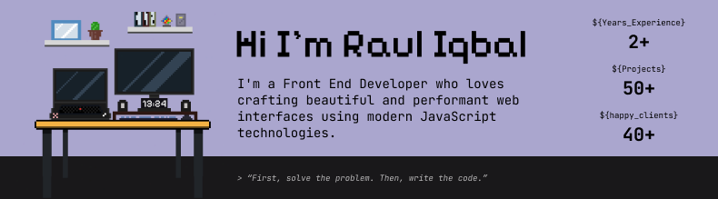

  “Striving to write clean code, build scalable systems, and bridge tech with aesthetic design.” ⚡

<h1 align="center">Hi 👋, I'm Raul Iqbal a Software Engineer</h1>

<a href="https://https://rauliqbal.my.id">Website</a> •
<a href="https://azuracoder.vercel.app">Blog</a> •
<a href="https://drive.google.com/file/d/1dS47nWLM7wh3569pFGHp9GIwBPqH0rUp/view?usp=sharing">Resume</a>

---

I am a passionate Full-Stack Developer and Technical Writer based in Indonesia. I love building modern, high-performance web applications, engineering robust backend systems, and documenting complex technical concepts into clear, digestible content.

With a strong focus on the JavaScript/TypeScript ecosystem, I bridge the gap between elegant user interfaces and scalable system architectures.

---

- 📚 Currently Learning: **DevOps, Security and API Engineering**
- 📍 Based in **Jakarta, Indonesia**
- ⚡ Fun Fact: **I balance on a fine line between the cutting edge and the historical. On any given day, I’m either building with the absolute latest tech like Nuxt 4, Laravel 12, and Tailwind CSS v4, or diving deep into the trenches to refactor legacy systems like CakePHP 2 and old-school Java financial modules.**

## 🌐 Connect With Me

- <a href="https://github.com/Rauliqbal">🐙 GitHub</a>
- <a href="https://linkedin.com/in/muhamad-raul-iqbal">💼 LinkedIn</a>

## 🛠 Tech Stack

---

### 🚀 Featured Projects
- 🐙 <a href="https://git-persona.vercel.app">GitPersona - Git Profile Generator Readme</a>
- 🧩 <a href="https://niceui.my.id">Nice UI - Tailwind CSS Component Library</a>
- 🎬 <a href="https://iratoon.vercel.app">IRATOON - Streaming Anime and Movie</a> 
- ✍️ <a href="http://azuracoder.vercel.app/articles/">AzuraCoder - Blog</a>
- 📖 <a href="https://www.ngajee.web.id/">Ngajee - Al Quran Indonesia</a>

---

### ✍️ Technical Writing & Musings
Beyond writing code, I love breaking down complex architectures, modern frameworks, and legacy migration strategies into well-structured articles and documentation. Check out my thoughts and portfolio at:
🌐 **[Artikel](https://azuracoder.vercel.app)**

---

